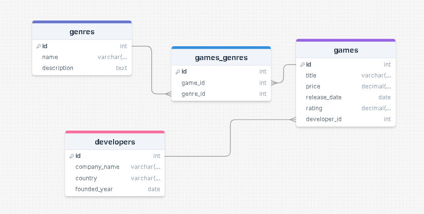

# 🎮 GameVault: İlişkisel Oyun Veritabanı Projesi

**SQL_GameVault**, modern bir oyun kütüphanesinin arka planındaki veri mimarisini modelleyen ilişkisel bir PostgreSQL veritabanı projesidir.  
Proje; oyunlar, geliştiriciler ve türler arasındaki karmaşık bağları (One-to-Many ve Many-to-Many) yönetmek, dinamik fiyat analizleri yapmak ve veri bütünlüğünü korumak amacıyla tasarlanmıştır.

---

## 🏗️ Veritabanı Mimarisi

Sistem, veri tutarlılığını en üst düzeyde tutmak için **4 temel tablo** üzerine inşa edilmiştir:

| Tablo | Açıklama |
|-------|----------|
| `developers` | Geliştirici firmaların bilgilerini tutar |
| `games` | Oyunların fiyat, puan ve çıkış tarihi gibi teknik verilerini saklar |
| `genres` | Oyun kategorilerini tanımlar |
| `games_genres` | Oyunlar ve türler arasındaki Many-to-Many ilişkiyi sağlayan köprü tablo |

---

## 🛡️ Öne Çıkan Teknik Özellikler

- **ON DELETE CASCADE**: Ana tablodan bir oyun silindiğinde, ona bağlı tüm alt verilerin (tür eşleşmeleri vb.) otomatik olarak temizlenmesini sağlar.
- **Relational Mapping**: INNER JOIN sorguları ile tablolar arası veri akışı optimize edilmiştir.
- **Data Integrity**: PRIMARY KEY ve FOREIGN KEY yapıları ile yetim kayıt (orphan records) oluşumu engellenmiştir.
- **Transaction & CRUD**: Veri ekleme, silme, güncelleme ve listeleme işlemleri transaction mantığıyla güvenli şekilde uygulanmıştır.

---

## 🔍 Örnek Sorgu Yetenekleri

- Tüm oyunları geliştirici isimleriyle birlikte listeleme.
- Sadece belirli bir türe (Örn: RPG) ait oyunları puan bazlı filtreleme.
- Fiyatı belirli bir limitin üzerindeki oyunları pahalıdan ucuza sıralama.
- LIKE operatörü ile akıllı metin arama (İsminde "War" geçen oyunlar vb.).
- Veritabanı genelinde %10 toplu fiyat güncellemesi.

---

## 🖼️ Veritabanı Şeması

  
Tablolar arasındaki ilişkileri ve Many-to-Many köprü tabloları görsel olarak inceleyebilirsiniz.

---

## 📂 Dosya İçeriği

Proje, hem hızlı kurulum hem de modüler inceleme için aşağıdaki yapıya göre organize edilmiştir:

| Dosya / Klasör | Açıklama |
|----------------|----------|
| `DrawSQL.png` | Veritabanı mimarisini ve tablolar arası ilişkileri gösteren ER Diyagramı |
| `gamevault_queries.sql` | Tüm CRUD ve raporlama sorgularını içeren SQL betiği |
| `README.md` | Proje açıklaması ve kullanım rehberi |

> İleride modüler hale getirmek istersen tablo oluşturma, veri ekleme ve raporlama betiklerini ayrı SQL dosyalarına bölebilirsiniz.

---

## ⚡ Kullanım

1. PostgreSQL kurulumu yapın.
2. SQL betiğini çalıştırın:

```bash
psql -U your_user -d your_db -f gamevault_queries.sql

👤 Hazırlayan

Ömer Yalçınkaya

🔗 Lisans

Bu proje, **YETGİM Data Analytics Bootcamp** kapsamında, iş zekası ve PostgreSQL eğitim amaçlı hazırlanmıştır.  
Eğitim ve referans kullanımına yöneliktir.
